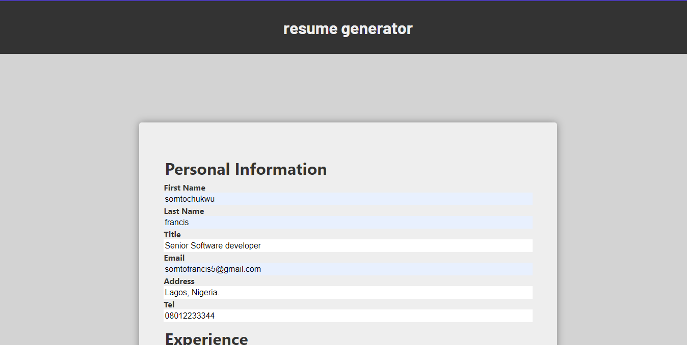
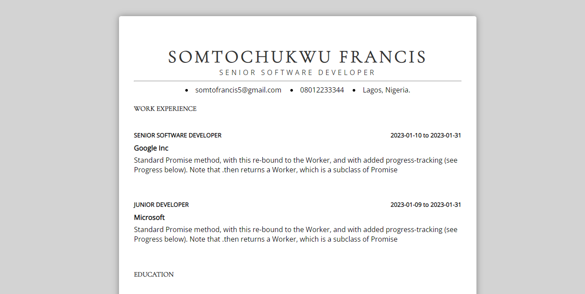

# CV GENERATOR

CV Generator webapp craeted with ReactJS.
Fill in your information and get an ATS compliant resume instantly.

## [What You'll Get](./Doc-resources/myCv.pdf)

## [View Live](https://somtojf.github.io/cv-project/)

## Getting Started

In order to setup and work on this project on your own, you will need to:

1. Fork and Clone this project
2. Once you have cloned this project, you can install the required dependencies by using: npm install
3. A live demo of the project can be started by using: `npm start`
4. Distribution files can be produced using: `npm run build`

## Contributions 🤝

Contributions, Issues and feature requests are very much welcome!

## Show your Support

If you got until here, show your love hitting the ⭐️ button, I'd really appreciate it.
